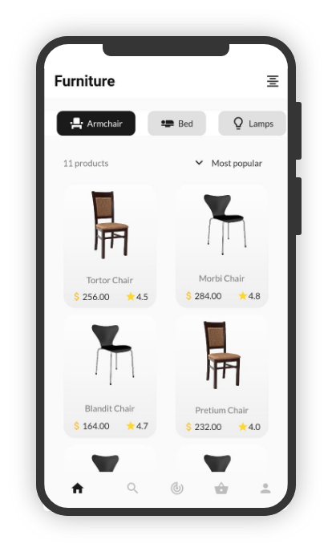

# FurnitureStore

<p align="center">
  <a href="#-projeto">Projeto</a>&nbsp;&nbsp;&nbsp;|&nbsp;&nbsp;&nbsp;
  <a href="#-tecnologias">Tecnologias</a>&nbsp;&nbsp;&nbsp;|&nbsp;&nbsp;&nbsp;
  <a href="#-instalação">Instalação</a>
</p>

<p align="center">
 
</p>

## 📱 Projeto

O projeto traz uma inspiração para uma app de loja virtual de móveis.

## 🚀 Tecnologias

Esse projeto foi desenvolvido com as seguintes tecnologias:

- [Flutter](https://flutter.dev/)
- [Dart](https://dart.dev/)

## 📁 Instalação

Para baixar esse projeto basta ter Git instalado no computador e executar o comando:
```
git clone https://github.com/rafacoelho4/FurnitureStore.git
```

---

Feito com ♥ by Rafael Coelho Monte Alto
